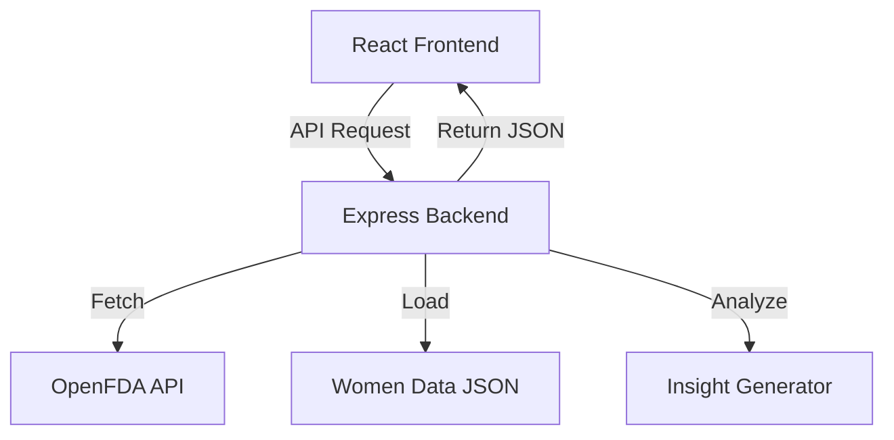

# Ms-Informed

Ms-Informed is a full-stack web application that helps women better understand medication side effects that are often underreported, dismissed, or not clearly emphasized in traditional medical documentation.

The platform combines official FDA drug label data with real-world, women-reported symptom patterns to surface insights that may not be prominently highlighted in clinical trials. It empowers users to better understand their symptoms and approach healthcare conversations with clarity and confidence.

---

## Project Description

Medication side effects are typically documented through clinical trials that have historically underrepresented women. As a result, some symptoms disproportionately experienced by women may not receive adequate attention in official documentation.

Ms-Informed addresses this gap by:

- Fetching official FDA drug label information via the OpenFDA API
- Comparing it against a structured dataset of women-reported symptom patterns
- Detecting potentially under-discussed symptoms
- Generating doctor-ready discussion prompts

This tool is designed for women seeking clarity around their medication experiences and aiming to have more informed conversations with healthcare providers.

---

## Tech Stack

### Frontend

- **React (Vite)** – Fast development and optimized production builds
- **Vanilla CSS (custom design system)** – Soft editorial aesthetic with responsive layout
- **Fetch API** – Communication with backend endpoints

### Backend

- **Node.js**
- **Express (v5)** – REST API server
- **Axios** – External API calls
- **Custom JSON dataset** – Women-reported symptom data
- **Rule-based analysis engine** – Under-discussed symptom detection

### External APIs

- **OpenFDA Drug Label API**

### Deployment

- **Render** – Single full-stack service deployment
- Express serves React production build

---

## Features

- **Medication Search** — Search for medications by brand or generic name.
- **Official FDA Data Integration** — Retrieves adverse reactions from OpenFDA drug labels.
- **Women-Reported Symptom Visualization** — Displays structured community-reported symptom frequencies.
- **Under-Discussed Symptom Detection** — Compares official text against women-reported patterns to detect gaps.
- **Insight Generation Engine** — Generates contextual summaries highlighting patterns.
- **Doctor Conversation Prompts** — Suggests structured questions users can ask healthcare providers.
- **Collapsible Official Side Effects** — Keeps focus on community insights while preserving official data access.
- **Responsive UI** — Clean, editorial design optimized for desktop and mobile.

---

## Installation

Clone the repository:

```bash
git clone https://github.com/your-username/ms-informed.git
cd ms-informed
```

Install frontend and backend dependencies:

```bash
cd frontend
npm install

cd ../backend
npm install
```

---

## Run Locally

### Run Backend

```bash
cd backend
node server.js
```

Backend runs on:

```
http://localhost:5000
```

### Run Frontend (Development Mode)

```bash
cd frontend
npm run dev
```

Frontend runs on:

```
http://localhost:5173
```

> Note: In development, Vite proxy configuration forwards `/api` calls to the backend.

---

## Production Build

From root directory:

```bash
npm run build
npm start
```

This builds the React app, serves it via Express, and runs the full stack on one port.

---

## Architecture



1. The React frontend sends search queries to the Express backend.
2. The backend fetches official drug data from OpenFDA.
3. It loads structured women-reported data from a local JSON dataset.
4. A rule-based engine compares both datasets.
5. Results are returned and rendered dynamically in the UI.

---

## API Documentation

### `GET /api/drug/:name`

Fetches official FDA side effects and women-reported symptom data.

**Example Request**

```
GET /api/drug/sertraline
```

**Example Response**

```json
{
  "drug": "Sertraline",
  "official_side_effects": ["nausea", "insomnia", "dizziness"],
  "women_reported": {
    "cycle_irregularity": 34,
    "low_libido": 52,
    "emotional_blunting": 67
  }
}
```

---

### `POST /api/analysis`

Generates under-discussed symptom detection and insights.

**Request Body**

```json
{
  "drug": "sertraline"
}
```

**Example Response**

```json
{
  "drug": "sertraline",
  "community": {
    "reported": {
      "cycle_irregularity": 34,
      "low_libido": 52
    },
    "under_discussed": ["cycle_irregularity", "low_libido"]
  },
  "insights": {
    "summary": "Community-reported symptoms such as cycle irregularity and low libido appear more frequently among women but are not clearly emphasized in official documentation.",
    "doctor_questions": [
      "Could cycle irregularity be related to my use of sertraline?",
      "Could low libido be related to my use of sertraline?"
    ]
  }
}
```

Results are cached in memory to avoid redundant FDA API calls.

---

## Supported Drugs (Community Dataset)

| Drug | Key Reported Symptoms |
|---|---|
| Sertraline | Cycle irregularity, low libido, emotional blunting |
| Fluoxetine | Cycle changes, reduced libido, sleep disturbance |
| Ambien | Next-day drowsiness, memory gaps, sleep driving |
| Levothyroxine | Hair loss, heart palpitations, anxiety |
| Metformin | Nausea, cycle disruption, vitamin B12 depletion |
| Ibuprofen | Heavy periods, bloating, stomach cramps |
| Aspirin | Heavier periods, stomach irritation, nausea |

---

## Team

- **Meghna V S** — Backend Development, Data Logic, API Integration
- **Maya Rathish** — Frontend Development & UI/UX Design

---

## License

This project is licensed under the MIT License.

```
MIT License

Permission is hereby granted, free of charge, to any person obtaining a copy
of this software and associated documentation files (the "Software"), to deal
in the Software without restriction, including without limitation the rights
to use, copy, modify, merge, publish, distribute, sublicense, and/or sell
copies of the Software, and to permit persons to whom the Software is
furnished to do so, subject to the following conditions:

The above copyright notice and this permission notice shall be included in all
copies or substantial portions of the Software.
```

---

## Disclaimer

Ms-Informed is for informational purposes only and does not replace professional medical advice, diagnosis, or treatment. Always consult a qualified healthcare provider regarding medical concerns.
